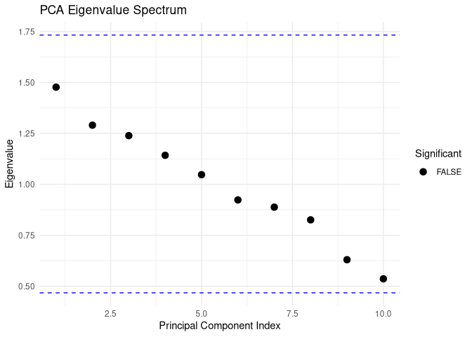
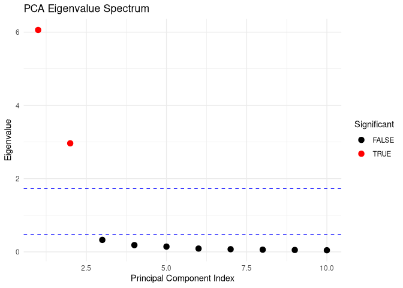

<!-- README.md is generated from README.Rmd. Please edit that file -->

# sigPCA 

The `sigPCA` package provides tools to assess the statistical
significance of principal components using methods from random matrix
theory, particularly the Marchenko–Pastur (MP) distribution. It also
includes an optional permutation-based method for empirical validation.

## Installation

``` r
# 
install.packages("pak") pak::pak("guillermodeandajauregui/sigPCA")
```

## Example 1: White Noise (No Signal Expected)

``` r
set.seed(123)
X_white <- matrix(rnorm(1000), nrow = 100, ncol = 10)
result_white <- sigPCA(X_white, method = "both", num_permutations = 100)
result_white$mp$significant_components
#> integer(0)
plot_sigPCA(result_white$mp$eigenvalues, result_white$mp$mp_bounds)
```

<!-- -->

## Example 2: Latent Structure (Signal Expected)

``` r
set.seed(456)
{
  n <- 100
  p <- 10
  k <- 2
  latent <- matrix(rnorm(n * k, mean = 3), nrow = n, ncol = k)
  loadings <- matrix(rnorm(p * k), nrow = k, ncol = p)
  noise <- matrix(rnorm(n * p, sd = 0.3), nrow = n, ncol = p)
  X_signal <- latent %*% loadings + noise
  result_signal <- sigPCA(X_signal, method = "both", num_permutations = 100)
}
result_signal$mp$significant_components
#> [1] 1 2
plot_sigPCA(result_signal$mp$eigenvalues, result_signal$mp$mp_bounds)
```

<!-- -->

## Interpretation

Components with eigenvalues beyond the theoretical Marchenko–Pastur
upper bound are considered statistically significant. This method is
particularly effective for high-dimensional datasets where traditional
heuristics like scree plots may be misleading.

The permutation-based method provides empirical *p*-values and is useful
as a secondary or confirmatory approach.

## References

- Marchenko, V.A. and Pastur, L.A. (1967). *Distribution of eigenvalues
  for some sets of random matrices*. Mathematics of the USSR-Sbornik,
  **1**(4), 457–483.
- Hernández-Lemus, E. *(in preparation)*.
